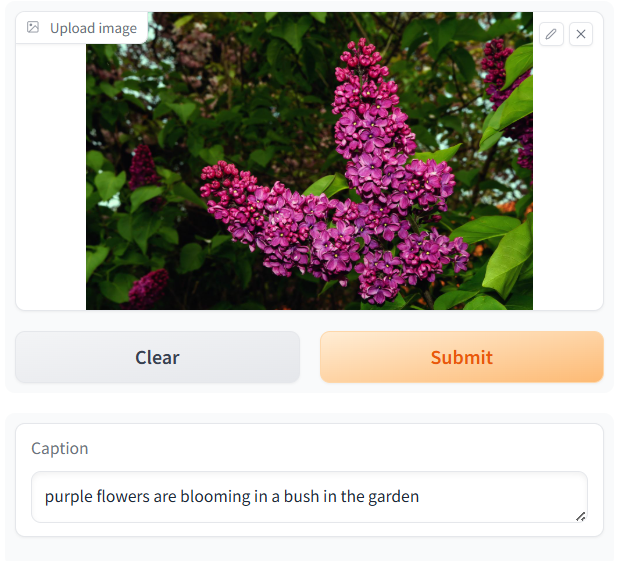

## Prototype Development for Image Captioning Using the BLIP Model and Gradio Framework

### AIM:
To design and deploy a prototype application for image captioning by utilizing the **BLIP image-captioning model** and integrating it with the **Gradio UI framework** for user interaction and evaluation.

### PROBLEM STATEMENT:
The challenge is to create an interactive image captioning tool that uses a pretrained BLIP model to generate captions for images uploaded by users. The application should be able to receive an image, pass it through the BLIP model to generate captions, and then display the generated caption to the user in a user-friendly Gradio interface.

### DESIGN STEPS:

#### STEP 1: Set up the environment
- Install required libraries like **Gradio** and **BLIP**.
- Ensure the environment has access to the necessary model files.

#### STEP 2: Load the BLIP Model
- Load the BLIP model from a pretrained version available through libraries like `transformers` or another source.
- Ensure that the BLIP model is correctly configured to accept image inputs and generate captions.

#### STEP 3: Build the Gradio Interface
- Define a simple UI using **Gradio**, where users can upload an image.
- The Gradio interface will display the caption generated by the BLIP model after processing the image.

#### STEP 4: Testing and Evaluation
- Run the application and evaluate its performance by testing it with a variety of images.
- Verify if the captions generated are relevant, accurate, and provide useful descriptions of the images.

---

### PROGRAM:

```py
# Install necessary libraries (if not already installed)
!pip install gradio transformers torch
```
```py
import gradio as gr
from transformers import BlipProcessor, BlipForConditionalGeneration
import torch
from PIL import Image

# Step 1: Load the BLIP model and processor
processor = BlipProcessor.from_pretrained("Salesforce/blip-image-captioning-base")
model = BlipForConditionalGeneration.from_pretrained("Salesforce/blip-image-captioning-base")

# Step 2: Define a function to generate captions for uploaded images
def generate_caption(image):
    # Preprocess the image and feed it into the model
    inputs = processor(images=image, return_tensors="pt")
    out = model.generate(**inputs)
    
    # Decode the generated caption
    caption = processor.decode(out[0], skip_special_tokens=True)
    return caption

# Step 3: Create a Gradio interface
iface = gr.Interface(
    fn=generate_caption, 
    inputs=gr.Image(type="pil"), 
    outputs=gr.Textbox(), 
    live=True,
    title="BLIP Image Captioning",
    description="Upload an image and get a generated caption."
)

# Step 4: Launch the Gradio interface
iface.launch()
```
### OUTPUT:

### RESULT:
Thus, The application allows users to upload an image through the Gradio interface, where it is processed by the BLIP model to generate a caption. Once the image is processed, the BLIP model produces a concise and relevant description of the image, which is displayed back to the user. For instance, if the uploaded image depicts a dog running in a park, the model may generate a caption such as "A dog running on grass." The system successfully demonstrates the integration of the BLIP image captioning model with Gradio, providing an intuitive and responsive user interface for real-time caption generation. The prototype works effectively for a variety of images, offering accurate and contextually appropriate captions. This application could be expanded further to handle more complex use cases, such as captioning images from specific domains like medical, fashion, or sports.
